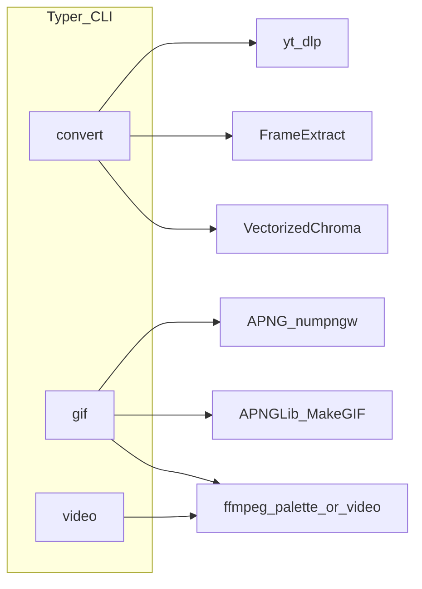
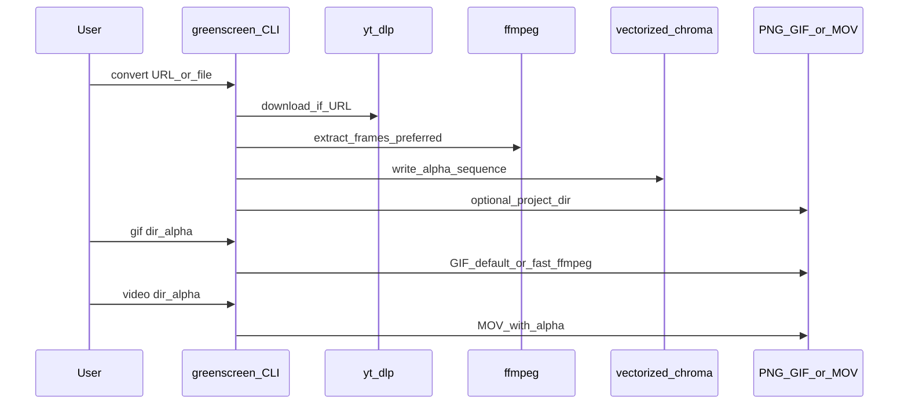

# Green screen video to alpha PNGs

Turn green-screen footage into **RGBA PNG sequences**, optional **transparent GIF**, and **alpha video** (QuickTime-friendly), for tools like **Lens Studio**.

[](https://www.python.org/downloads/)
[](LICENSE)

## Features

- **convert** — YouTube URL or local video → frame folder → `*_alpha` RGBA PNGs (`yt-dlp`, vectorized chroma, tqdm).
- **gif** — PNG folder → transparent GIF (default: `numpngw` + **APNGLib**; optional **`--fast-ffmpeg`** palette path).
- **video** — PNG folder → `.mov` with alpha (`qtrle` or `prores_4444` via ffmpeg).

## Quick start (uv)

```powershell
# Windows (PowerShell)
.\install.ps1
uv run greenscreen --help
```

```bash
# Linux / macOS
bash install.sh
uv run greenscreen --help
```

Install dev tools: `uv sync --extra dev`

### APNGLib (optional C++ extension)

The default GIF path uses the **APNGLib** native module (libpng + zlib). If headers/libs are missing, install in **editable** mode without it:

```powershell
$env:SKIP_APNGLIB='1'; uv sync --extra dev
```

Then use **`greenscreen gif --fast-ffmpeg <dir>`** (no APNGLib). To compile APNGLib: install **libpng** and **zlib** (e.g. vcpkg / MSYS2 / Linux `-dev` packages), then:

```powershell
$env:SKIP_APNGLIB='0'; uv sync --extra dev
```

## CLI

```text
greenscreen convert <URL|video.mp4>     # download or local file, chroma, optional project_* folder
greenscreen gif <dir> [--fast-ffmpeg]   # transparent GIF
greenscreen video <dir> [--fps 30]      # alpha .mov (ffmpeg)
```

Legacy entry points still work and forward to the same CLI:

- `python GreenVideotoAlphaPNGs.py <url>` → `greenscreen convert`
- `python GIFGenerator.py <dir>` → `greenscreen gif`
- `python VideoGenerator.py <dir>` → `greenscreen video`

## Prerequisites

- **Python 3.12+** (repo pins `.python-version` to 3.12 for uv).
- **ffmpeg** on `PATH` for fast frame extract and for `gif --fast-ffmpeg` / `video`. A fallback binary can come from **`imageio-ffmpeg`** if PATH has no ffmpeg.

## Architecture



## Sequence (typical Lens Studio flow)



## UML / diagrams (Cursor)

1. **Optional:** clone [uml-mcp](https://github.com/antoinebou12/uml-mcp) into **`uml-mcp/`** at this repo root so `uml-mcp/server.py` exists (matches [`.cursor/mcp.json`](.cursor/mcp.json) `cwd`).
2. Or use the registry flow: `npx -y @smithery/cli install antoinebou12/uml --client cursor` (see [Cursor integration](https://github.com/antoinebou12/uml-mcp/blob/main/docs/integrations/cursor.md)).
3. Diagram output can land under [`docs/diagrams/`](docs/diagrams/) when using the bundled MCP env.

For **library API details** while developing (Typer, yt-dlp, etc.), use **Context7** in Cursor when available.

## Lens Studio (Snapchat AR)

After generating the sequence:

1. Resources → Add New → 2D animation from files.
2. Tune audio / cutout animation on the object.

You can also import a transparent GIF or alpha `.mov` if your pipeline produced one.


## References

- [Lens Studio guide (video)](https://www.youtube.com/watch?v=7kmFh8KtgEg)
- Chroma / matting background: [Wikipedia: Chroma key](https://en.wikipedia.org/wiki/Chroma_key)

## License

MIT — see [LICENSE](LICENSE).
